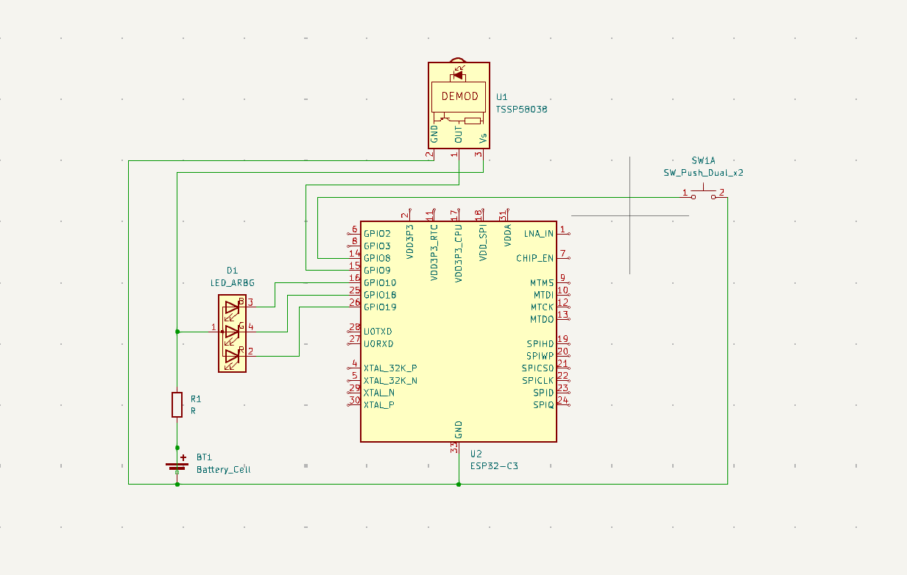

# Wi-Fi Crowdness & Help Button System

## 1. High-Level Overview

### Project Title: **Wi-Fi Crowdness & Help Button System**

### What It Does
This project consists of two devices communicating over Wi-Fi:

1. **Help Button Device**:
   - Counts people passing by using a sensor.
   - Provides a help button for customers to request assistance.
   - Lights up an LED once the help request is acknowledged by the Monitor Device.

2. **Monitor Device**:
   - Aggregates data from multiple Help Button Devices.
   - Displays the crowdness level on a stepper-motor gauge.
   - Provides a screen interface for more detailed data and insights.

### General Sketch (Highlighting Physical Features)
#### Help Button Device:
- **Wi-Fi MCU**
- **People-Counting Sensor** (ToF/PIR)
- **Button** (Request Help)
- **LED** (Help Confirmation)

#### Monitor Device (Console):
- **Wi-Fi MCU**
- **Screen** (UI + Data from Help Devices)
- **Stepper-Motor Gauge** (Crowdness Level)
- Optional **Button** for staff interactions


---

## 2. Help Button Device

### Detailed Sketch


### How It Works
- **People-Counting Sensor**:
  - Uses a Time-of-Flight sensor (e.g., ST VL53L1X) or a simple PIR motion sensor to detect and count passersby in real time.
- **Help Button**:
  - When pressed, it sends a "HELP_REQUEST" message over Wi-Fi to the Monitor Device.
- **LED**:
  - Lights up once the Monitor Device acknowledges the request (confirmation message: “Help is on the way”).
- **Wi-Fi MCU**:
  - Aggregates data from the sensor and the button, and sends it periodically or on events to the Monitor Device.

---

## 3. Monitor Device

### Detailed Sketch


### How It Works
- **Wi-Fi MCU**:
  - Connects to the local network and receives data from multiple Help Button Devices.
  - Aggregates:
    - **People Counts** to gauge aisle/store section busyness.
    - **Help Requests** to see customer needs.
- **Screen**:
  - Displays a user interface with detailed stats (e.g., people counts, help requests, aisle name).
- **Stepper Motor Gauge**:
  - Reflects the overall crowdness level (0–100 scale).
  - Higher values indicate increased foot traffic, helping allocate more staff.
- **Optional Button**:
  - Allows staff to confirm requests or navigate menu items.

---

## 4. Communication & System Diagram

### Communication Workflow (Figure A)


---

## 5. Hardware Choices & Part Numbers

### Help Button Device
| **Component**            | **Description**                                                                 |
|--------------------------|---------------------------------------------------------------------------------|
| **Wi-Fi MCU**            | ESP32-WROOM-32 or ESP8266-based modules                                        |
| **Sensor**               | ST VL53L1X (Time-of-Flight, accurate short-to-mid range) or PIR motion sensor |
| **Button**               | Generic tactile push-button                                                   |
| **LED**                  | 5 mm LED with a current-limiting resistor                                      |
| **Power Supply**         | Lithium-ion battery + AMS1117-3.3 voltage regulator                           |

### Monitor Device
| **Component**            | **Description**                                                                 |
|--------------------------|---------------------------------------------------------------------------------|
| **Wi-Fi MCU**            | ESP32-WROOM-32 or ESP8266-based modules                                        |
| **Screen**               | 7.0" TFT LCD with ILI9488 or RA8875 controller (800x480 or 1024x600 resolution) |
| **Stepper Motor**        | 28BYJ-48 stepper motor with ULN2003 driver or NEMA17 with A4988 driver         |
| **Power Supply**         | USB power adapter or lithium-ion battery pack                                  |

---

## 6. Installation and Usage

1. **Clone the Repository**:
   ```bash
   git clone https://github.com/yourusername/HWSW_Project_I.git
